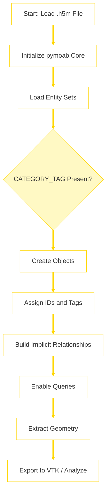

<!-- docs/source/methodology.md -->

# Methodology

PyDAGMC provides a Pythonic abstraction layer over PyMOAB for interacting with DAGMC (Direct Accelerated Geometry Monte Carlo) `.h5m` files. This section delves into the underlying concepts, data structures, and design choices that enable PyDAGMC's functionality.

## PyDAGMC's Internal Initialization Process

While PyDAGMC is a tool intended for use within a larger, user-defined workflow, it's helpful to understand the internal sequence of operations that occurs when a `.h5m` file is loaded. The following diagram illustrates this initialization process, which culminates in a fully interactive `Model` object ready for querying and manipulation. This is not a prescribed user workflow, but rather a conceptual map of how PyDAGMC parses and prepares the geometry data.

## Core Design Philosophy

The primary goal of PyDAGMC is to simplify common interactions with DAGMC models by:

1. **Object-Oriented Interface:** Representing DAGMC entities (Groups, Volumes, Surfaces) as intuitive Python objects with methods and properties relevant to their roles.
2. **Abstraction of PyMOAB Complexity:** Hiding some of the lower-level details of PyMOAB's API, particularly around tag handling and entity set traversal for common DAGMC use cases.
3. **Focus on DAGMC Semantics:** Leveraging the specific metadata conventions established by DAGMC for identifying and relating geometric entities.
4. **Ease of Use:** Providing a higher-level API that reduces boilerplate code for common queries and manipulations.

## The DAGMC Data Model

For a detailed explanation of the underlying data structures, see the  page.

## PyDAGMC Class Structure

The main classes in PyDAGMC mirror the DAGMC entity hierarchy:

* **`Model`:**
  * The entry point for loading and interacting with a DAGMC `.h5m` file.
  * It initializes a `pymoab.core.Core` instance.
  * Provides access to all `Group`s, `Volume`s, and `Surface`s in the model via properties like `model.groups_by_name`, `model.volumes_by_id`, etc.
  * Manages cached MOAB tag handles for efficiency.
  * Tracks used entity IDs to assist in assigning unique IDs to newly created entities.

* **`GeometrySet` (Abstract Base Class):**
  * Provides common functionality for `Group`, `Volume`, and `Surface`.
  * Manages the MOAB entity `handle`.
  * Provides properties for common tags (`id`, `geom_dimension`, `category`).
  * Includes methods for triangle data extraction (`triangle_handles`, `triangle_conn`, `triangle_coords`, `get_triangle_conn_and_coords`), VTK export (`to_vtk`), and entity deletion (`delete`).
  * The `_check_category_and_dimension()` method enforces consistency between `CATEGORY_TAG` and `GEOM_DIMENSION_TAG`.

* **`Surface(GeometrySet)`:**
  * Represents a 2D geometric surface.
  * Provides access to its sense data (`senses`, `forward_volume`, `reverse_volume`).
  * Calculates surface area (`area`).
  * Directly contains triangle mesh elements (`MBTRI`).

* **`Volume(GeometrySet)`:**
  * Represents a 3D geometric volume.
  * Provides access to its constituent `Surface`s (`surfaces`, `surfaces_by_id`).
  * Determines its material assignment by looking for a parent `Group` with a name like `"mat:..."` (`material` property).
  * Calculates its geometric volume (`volume`) using the divergence theorem on its bounding surface triangles and their senses.

* **`Group(GeometrySet)`:**
  * Represents a logical collection of `Volume`s and/or `Surface`s.
  * Identified by a `name` (from `NAME_TAG_NAME`).
  * Provides access to its contained `Volume`s (`volumes`, `volumes_by_id`, `volume_ids`) and `Surface`s (`surfaces`, `surfaces_by_id`, `surface_ids`).
  * Supports adding (`add_set`) and removing (`remove_set`) entities.
  * The `merge()` method allows combining two groups with the same name.

## Key Operations and Their Implementation

* **Loading a Model (`Model(filename)`):**
  * Initializes `pymoab.core.Core()`.
  * Calls `mb.load_file(filename)`.
  * Pre-populates `used_ids` by querying existing entities.

* **Accessing Entities (e.g., `model.volumes_by_id`):**
  * Uses `mb.get_entities_by_type_and_tag()` with the root set and the `CATEGORY_TAG` to find all entity sets of a specific type (e.g., "Volume").
  * For each handle found, a PyDAGMC object (e.g., `Volume(model, handle)`) is instantiated.
  * These are often collected into dictionaries keyed by ID for quick access.

* **Triangle Data (`.triangle_coords`, `.triangle_conn`):**
  * `Surface._get_triangle_sets()` returns itself.
  * `Volume._get_triangle_sets()` iterates through its child surfaces and collects their handles.
  * `Group._get_triangle_sets()` iterates through its child surfaces and volumes (recursively calling their `_get_triangle_sets()`).
  * `GeometrySet.triangle_handles` then uses `mb.get_entities_by_type(handle, types.MBTRI)` on these collected surface/set handles.
  * `mb.get_connectivity()` and `mb.get_coords()` are then used on the triangle handles.

* **Material Assignment (`Volume.material`):**
  * The `Volume.groups` property finds all parent groups of the volume.
  * It then iterates through these groups, checking if their `group.name` starts with `"mat:"`. The first one found determines the material.
  * Setting `Volume.material = "new_mat"` will:
    * Remove the volume from its current material group (if any).
    * Find or create a `Group` named `"mat:new_mat"`.
    * Add the volume to this new/existing material group.

* **Entity Creation (e.g., `Model.create_volume()`):**
  * Calls `mb.create_meshset()` to get a new entity set handle.
  * Wraps this handle in a temporary `GeometrySet` to set the default `CATEGORY_TAG` and `GEOM_DIMENSION_TAG` appropriate for the entity type (e.g., "Volume", 3).
  * Then, the specific class (e.g., `Volume`) is instantiated with this configured handle.
  * An ID is assigned, either user-provided or auto-generated to be unique within the model for that entity type.

* **Volume Calculation (`Volume.volume`):**
    The volume of a `Volume` object is calculated using the formula derived from the divergence theorem:

    $$ V = \frac{1}{3} \sum_{i \in \text{surfaces}} \text{sign}_i \sum_{j \in \text{triangles in surface } i} (\mathbf{a}_j \times \mathbf{b}_j) \cdot \mathbf{c}_j / 2 $$

    This simplifies to:

    $$ V = \frac{1}{6} \sum_{s \in \text{Surfaces}} \text{sense}(s,V) \sum_{t \in \text{Triangles in } s} \det(\mathbf{v}_{t1}, \mathbf{v}_{t2}, \mathbf{v}_{t3}) $$

    where $\text{sense}(s,V)$ is +1 if $V$ is the forward volume of surface $s$, and -1 if it's the reverse volume. $\mathbf{v}_{t1}, \mathbf{v}_{t2}, \mathbf{v}_{t3}$ are the vertex coordinates of triangle $t$.

    PyDAGMC iterates through each `Surface` of the `Volume`. For each triangle in the surface, it computes $\sum (\mathbf{r}_0 \cdot (\mathbf{r}_1 - \mathbf{r}_0) \times (\mathbf{r}_2 - \mathbf{r}_0))$. The sum over all triangles is then scaled by $1/6$. The sign depends on whether the current `Volume` is the forward or reverse volume of the `Surface`.

## Limitations and Future Directions

* **Curve and Vertex Entities:** While DAGMC specifications include "Curve" and "Vertex" categories, PyDAGMC currently does not provide dedicated classes or extensive support for them.
* **Advanced Meshing Operations:** PyDAGMC focuses on querying and metadata manipulation, not on mesh generation or modification (beyond loading STLs into surfaces).
* **Performance for Extremely Large Models:** While PyMOAB is efficient, some PyDAGMC operations that iterate over many entities might be optimizable. Caching strategies are used (e.g., for tag handles) but could potentially be expanded.

This methodological overview should provide a clearer picture of how PyDAGMC functions internally and interacts with the underlying DAGMC and PyMOAB libraries.